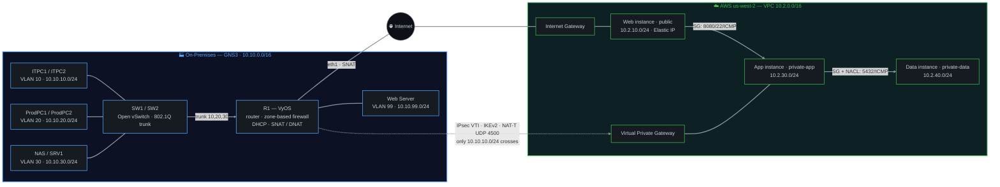

# Hybrid Cloud Network — On-Premises ↔ AWS over IPsec Site-to-Site VPN

A segmented on-premises network (simulated in **GNS3**) bridged to an **AWS VPC** over a **route-based IPsec site-to-site VPN**, with the cloud side fully provisioned in **Terraform**.

Built as a WGU BSCNE capstone project demonstrating Layer 2 segmentation, least-privilege routing, and defense-in-depth security controls across a hybrid on-prem/cloud environment.

---

## Architecture



The dotted line is the point of the project: an encrypted tunnel riding over the same physical internet path, scoped so that only the IT subnet can reach the cloud — Production has no path in either direction.

---

## On-Premises (GNS3)

| Element          | Detail                                                                                                          |
| ---------------- | ----------------------------------------------------------------------------------------------------------------- |
| **R1**           | VyOS router/firewall — 802.1Q router-on-a-stick, DHCP server, Source NAT (masquerade), Destination NAT (tcp/80 → web server), zone-based firewall |
| **SW1 / SW2**    | Open vSwitch — access ports by VLAN tag, 802.1Q trunks carrying VLANs 10/20/30                                    |
| **Segmentation** | VLAN 10 IT/Management · VLAN 20 Production · VLAN 30 Servers · VLAN 99 DMZ (10.10.99.0/24)                        |
| **Addressing**   | VLAN 10 & 20 dynamic via DHCP (pools .100–.200); VLAN 30 & 99 static                                              |
| **Policy**       | IT ↔ Server allowed, Production ↔ Server allowed, IT ↔ Production denied; DMZ reachable from the internet on `:80` only |

## AWS (Terraform)

| Element             | Detail                                                                                                                   |
| ------------------- | ------------------------------------------------------------------------------------------------------------------------ |
| **VPC**             | `10.2.0.0/16`, three tiers: public `10.2.10.0/24`, private-app `10.2.30.0/24`, private-data `10.2.40.0/24`               |
| **Routing**         | Public route table → IGW + VGW. Private route table → VGW only, no `0.0.0.0/0` — private tiers have no direct internet path |
| **Security Groups** | Stateful, per-instance. Data tier accepts traffic **exclusively** from the App tier's security group (SG-referencing, not CIDR) |
| **NACL**            | Stateless, per-subnet, second independent layer — ICMP and ephemeral-port return traffic explicitly allowed per tier so ping tests actually complete |
| **Compute**         | Three `t3.micro` instances; only the Web tier instance has a public address (Elastic IP)                                 |

## The VPN

Route-based IPsec on a virtual tunnel interface (`vti0`) via AWS Virtual Private Gateway, IKEv2 with NAT-Traversal over UDP 4500.

- **Least-privilege routing enforced at both ends.** On-prem, only `10.10.10.0/24` (IT) is routed into `vti0`; AWS is configured with a return route for that prefix only. Production (`10.10.20.0/24`) has no path to AWS in either direction — the restriction isn't just a firewall rule, it's baked into the routing tables on both sides, so a single misconfiguration can't quietly open the door.
- **Reachability is intentionally narrow.** The tunnel connects IT to the App instance (`10.2.30.0/24`) only. The Data instance is never reachable from on-prem, even from IT — it's reachable exclusively from the App tier's security group.

---

## Repository Structure

```
Terraform/          VPC, subnets, route tables, security groups, NACLs, EC2, VGW/CGW/VPN
gns3-config/         VyOS router config, Open vSwitch VLAN/trunk setup
Functionality Report/  Test case documentation and validation screenshots
```

`gns3-config/r1-vyos.conf` is the full router build: VLAN sub-interfaces, DHCP scopes, NAT rules, the zone-firewall policy matrix, and the IPsec section (secrets are placeholders).

## Deploying

```bash
cd Terraform
terraform init
terraform plan
terraform apply
```

You'll be prompted for `admin_cidr` (your management IP, not `0.0.0.0/0`), `customer_gateway_ip` (the site's public egress address), `key_name` (an existing EC2 key pair — verify with `aws ec2 describe-key-pairs`), and `vpc_id` (the lab-provided VPC).

Then apply `r1-vyos.conf` to the VyOS router, substituting the placeholders with the Terraform outputs (VPN tunnel address, preshared key, VGW/CGW IDs). `customer_gateway_ip` must be the site's public egress address — the address AWS actually sees R1's traffic coming from — not R1's local WAN interface IP, which may sit behind NAT.

---

## Engineering Highlights

Problems worth reading about, since each one cost real debugging time:

- **Stateless NACLs silently ate ping replies.** The Web tier's NACL allowed inbound HTTP/HTTPS/SSH but had no ICMP rule at all. Pings to the Web instance timed out even though the security group allowed ICMP — the echo request or its reply was being dropped one layer down, at the stateless NACL, which doesn't automatically permit return traffic the way a security group does. The fix was adding explicit ICMP allow rules in both directions on the Web and App NACLs.
- **The tunnel came up carrying zero traffic.** Security associations showed `up` on `show vpn ipsec sa`, but pings across the tunnel never got a reply. The static route toward the VPC wasn't installed correctly in R1's forwarding table — pointing the route at the tunnel *interface* looked right in the config but didn't actually push traffic into `vti0`. Re-specifying the route with an explicit **next-hop** (the AWS-side inside-tunnel address) fixed it immediately, and traffic started flowing.
- **GNS3 had no path to AWS without a bridge host.** The lab environment isn't directly attached to the internet, so a Linux host in between had to act as the bridge between GNS3 and the AWS VPN endpoint — handling IP forwarding and the `iptables` NAT rules needed to get packets from R1's WAN interface out to AWS. This turned troubleshooting into tracing a packet through six hops (PC → OVS → VyOS → Linux host → VPN → AWS) instead of two, since a failure at any single hop looked identical to a failure at any other from the GNS3 side.
- **The AWS side started as multi-AZ and had to be torn back down to one.** The initial Terraform put the App and Data tiers in different availability zones, which is a normal HA pattern but not what the capstone spec called for. Collapsing everything into a single AZ meant re-picking subnets and re-associating route tables and NACLs, and doing it without reaching for a NAT Gateway — since the private tiers were required to have no internet path at all, not just a metered one.

## Tech Stack

`VyOS` · `Open vSwitch` · `GNS3` · `IPsec / IKEv2 / NAT-T` · `802.1Q` · `AWS VPC` · `Site-to-Site VPN` · `Security Groups + NACLs` · `EC2` · `Terraform`
